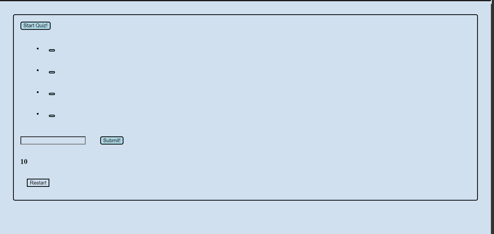
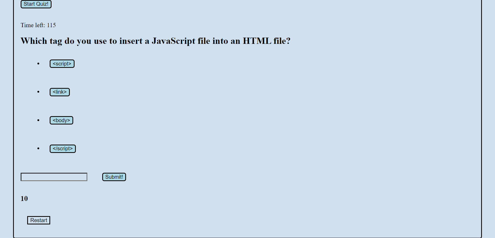
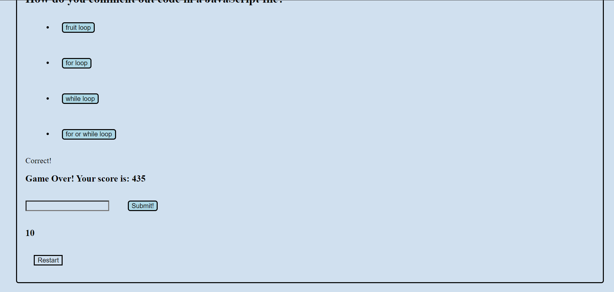

# Module4Challenge

## Description

Provide a short description explaining the what, why, and how of your project. Use the following questions as a guide:

- What was your motivation?
- Why did you build this project? (Note: the answer is not "Because it was a homework assignment.")
- What problem does it solve?
- What did you learn?

This project was built to test the user on basic JavaScript skills with a timed quiz. The motivation of this project was to implement the javascript skills learned during module 4. How to set data in local storage, addEventListeners and set timers were some of the things learned while carrying out this project. This quiz can help beginners test their fundamental JavaScript knowledge.

## Usage

How to use quiz:

- click start game
- click the chosen answer
- once quiz is done save your score by clicking submit

## Link 

The following is the URL link to the live page:

https://constantmotion1.github.io/Module4Challenge/

